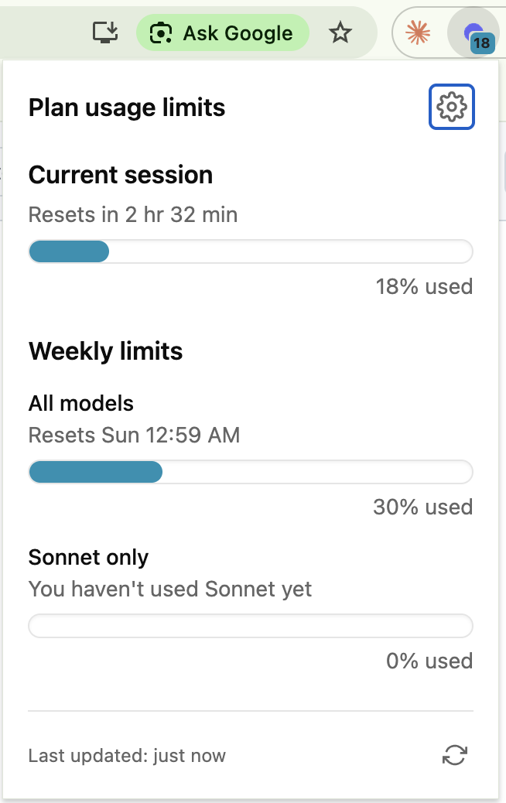
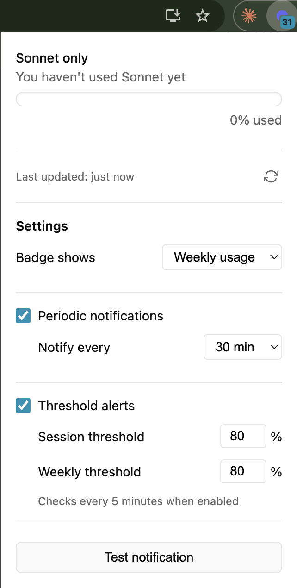
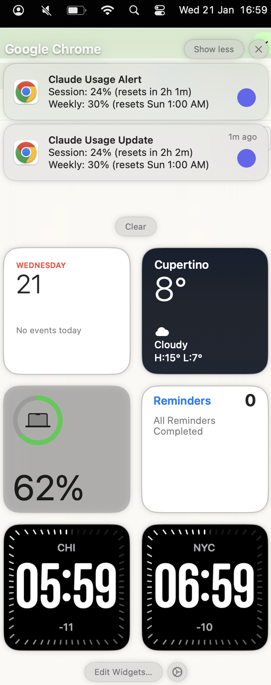

# Claude Usage Monitor

A Chrome extension that monitors your Claude.ai usage limits and displays them in a convenient popup. Get notified when you're approaching your limits.

## Features

- **Real-time usage display** - View your current session (5-hour) and weekly usage limits
- **Badge indicator** - Shows current session usage percentage on the extension icon
- **Color-coded progress bars** - Teal (< 50%), yellow (50-79%), red (80%+)
- **Periodic notifications** - Get usage updates at regular intervals (30 min to 4 hours)
- **Threshold alerts** - Get notified when usage crosses your defined thresholds
- **Sonnet usage tracking** - Separate tracking for Sonnet model usage

## Installation

1. Download or clone this repository
2. Open Chrome and navigate to `chrome://extensions`
3. Enable "Developer mode" (toggle in the top right)
4. Click "Load unpacked"
5. Select the `claude-usage-extension` folder

## Usage

1. Make sure you're logged into [claude.ai](https://claude.ai)
2. Click the extension icon to view your current usage
3. Click the gear icon to configure notifications

## Settings

### Periodic Notifications
Receive regular usage updates at your chosen interval:
- 30 minutes
- 1 hour
- 2 hours
- 4 hours

### Threshold Alerts
Get alerted when your usage crosses a threshold:
- **Session threshold** - Alert when 5-hour usage exceeds this percentage
- **Weekly threshold** - Alert when 7-day usage exceeds this percentage

Threshold checks run every 5 minutes when enabled. You'll only be notified once when crossing a threshold (resets when usage drops below).

## Permissions

- **storage** - Save your notification preferences
- **alarms** - Schedule periodic usage checks
- **notifications** - Send desktop notifications
- **host permissions (claude.ai)** - Fetch usage data from Claude.ai API

## Requirements

- Google Chrome browser
- Active Claude.ai account (must be logged in)

## Troubleshooting

**No data showing:**
- Make sure you're logged into claude.ai in the same browser
- Try clicking the refresh button in the popup

**Notifications not working:**
- Check that notifications are enabled in the extension settings
- Ensure Chrome has permission to send notifications (check system settings)
- For threshold alerts, make sure the threshold is set below your current usage

## License

MIT
